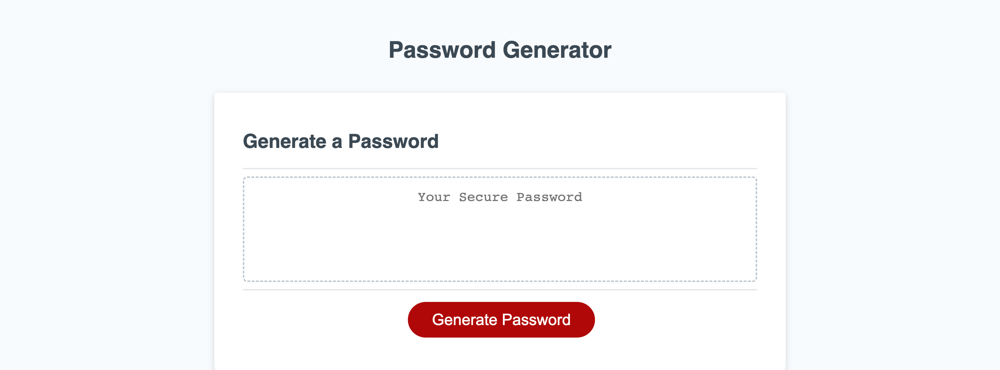

# musical-octo-adventure

## Description

As AN student I WANT to program password generator for the user with various types of variables simulating as an employee with sensitive data to strengthen user's sercurity.

Evertime the user click the button to generate a password he didn't get a reaction from the browser. The problem was there wasn't a function call on when user clicked the button. To solve this issue create a function prompting the user how long their password should be ranging from 8-128. Aslo prompt user to confirm or not to include certain types of variables. Giving the user to select(confirm) if they would like to include lowercase letters, uppercase letters, numbers, or special characters, occuring to user input it would generate and display password in textarea.

## Installation

What are the steps required to install your project? Provide a step-by-step description of how to get the development environment running.

1. You will need to create and initialize your local repo. Click this link for more help: https://coding-boot-camp.github.io/full-stack/git/getting-started-with-git

2. Got to https://github.com and create an account or sign in.

3. Once signed into Github click this link to redirect to the Repo: https://github.com/Lilhomie42/musical-octo-adventure then click on the code drop-down and click git clone and copy the HTTPS or SSH.

4. Then open your terminal, make sure you're in your local repo directory. Once in your directory type in the terminal git clone <And Paste HTTPS or SSH>.

5. Then type in terminal 'git pull origin main' you see a message in main branch.

6. Type in terminal code . to open repo in VS code.

    Deployed site:  https://lilhomie42.github.io/miniature-adventure/ 

## Usage

## Credits

Totur Sheetal Sirumar assisted with debugging issues occuring.

## License

🏆 MIT LICENSE

## Badges

